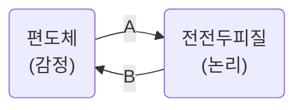

#마음의기술
 
이 메모는 신경과학박사이자 정신과의사인 안-엘렌 클레르와 인지행동치료 전문 심리학자이자 심리치료사인 뱅상 트리부가 지은 _마음의 기술_ 을 읽고 일상에서 실천하기 위해 정리한 내용이다.

> 하나의 이론이나 기반이 모든 문제를 해결할 수 있다는 해결책은 경계해야 한다.
> 뇌에서 일어나는 모든 활동이 지닌 복잡성과는 모순되기 때문이다.

신체활동과 정신활동이 별개가 아니라는 점을 유의하자, 운동과 식습관이 중요하다.

기저핵 : 뇌의 중심부에서 학습과 습관에 중요한 역할, ==반복==을 통해 기능을 바꿀 수 있다.
때문에 많은 기법들이 반복할 때 효과가 나타난다.
 

^68c946

A의 경우 이성적 접근이 작동하지 않는다. [초기 부적응 도식](12.%20심리%20도식의%20힘), [불안](26.%20불안)등이 있다.
B의 경우 [인지 편향](10.%20편향%20원칙), [도덕적 원칙](11.%20도덕적%20원칙의%20힘)에 의해 일어난다. [[21. 인지 재구조화]]가 도움이 된다.
  ^3a3217

---

- 불쾌감을 없애고 싶은 경우
  [[15. 심적 고통의 수용]]
   
- 자신에게 중요한 것을 놓쳤다는 감정이 드는 경우
  화내고 싶은 욕구, 상대를 끽소리도 못 하게 만들고 싶은 욕구는 당신을 만족시키는 근본 토대로부터 스스로 멀어지게 한다. [[16. 삶의 명확한 목표]]
   
- 수천 가지 생각으로 감정이 반복되고 더욱 고조되는 경우, 타인에게 열등감을 느끼는 경우
  [[17. 반추와 탈중심화]]
   
- 관계에서 무언가를 말하기 어려운 경우
  [[19. 자기주장]]
   
- 강렬한 감정에 휩싸이는 경우
  [[20. 마음챙김]]
   
- 개인적으로 마음에 많은 것을 담아두는 경우, 당신을 겨냥한 공격이 있다고 느낄 경우
  [[21. 인지 재구조화]]
   
- 적절하고 실용적으로 행동하지 못한다는 생각이 드는 경우
  [[21. 인지 재구조화]], [[22. 의사결정 기법]]
   
- 감정을 표현하기 어려운 경우
  [[19. 자기주장]], 억제한 감정 찾기([[24. 편지로 감정 비우기]]), [[12. 심리 도식의 힘]]

[[26. 불안]]

[[27. 실존적 불안]]

[[28. 슬픔]]

[[29. 자존감과 자신감]]

[[30. 스트레스]]

[[31. 번아웃 증후군]]

[[32. 완벽주의]]

[[33. 동기부여와 지연 행동]]

[[34. 행복 추구]]

[[36. 우울]]

[[37. 분노와 불의]]

[[38. 충동성]]

[[39. 수면]]

[[40. 음주와 정신자극제]]

[[43. 직장생활]]

[[44. 가족]]

[[45. 우정]]

[[46. 사랑]]

[[47. 죽음과 이별]]
